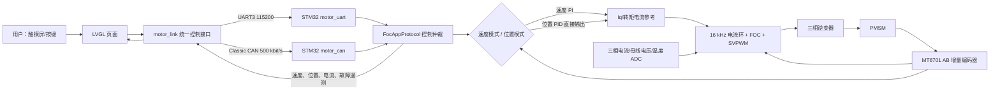
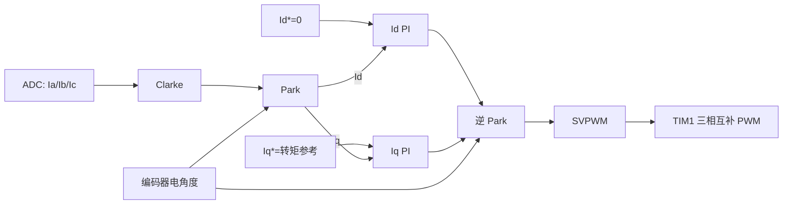
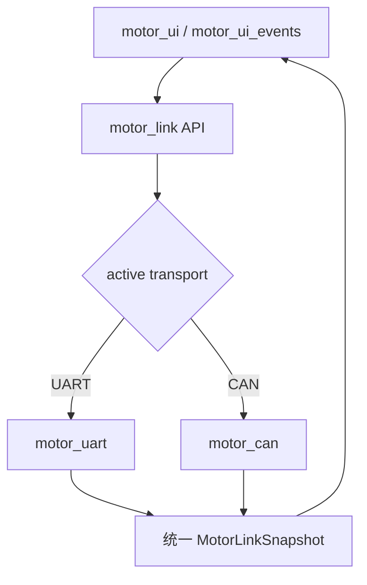

# MCSDK_MIX + ESP32_LVGL：一周掌握、代码拆解与面试指南

> 适用仓库：`E:\MotorControl` 当前工作区  
> STM32 工程实际目录：`MCSDK_FOC_MIX`  
> ESP32 工程实际目录：`ESP32_LVGL/ESP32_LVGL`  
> 文档范围：电机控制、STM32、UART/CAN、ESP32、FreeRTOS、BSP、LVGL；**不讲 Wi-Fi、MQTT 及云端网络链路**。  
> 代码基线：以当前源码为准，不以仓库中的历史说明文档为准。

---

## 0. 先建立正确目标

从零基础出发，一周不可能“完全掌握电机控制理论、MCSDK、STM32、FreeRTOS、LVGL 和两种通信协议”的全部细节。现实且可达成的目标是：

1. 能在白板上画出系统结构、控制环和端到端数据流。
2. 能从 `main` 入口沿调用链找到任意核心功能。
3. 能解释当前代码为什么这样写、关键参数在哪里、时序是多少。
4. 能独立完成烧录、联调、观察波形、定位常见故障。
5. 能诚实区分“MCSDK 自动生成”“第三方框架能力”“本项目二次开发”。
6. 面试时不背口号，而是用源码事实、取舍和问题闭环证明自己理解过项目。

这叫“达到可答辩的项目负责人水平”，比声称“所有底层算法都由我独立实现”更可信。

### 0.1 简历中的诚实边界

推荐表述：

> 基于 STM32G431、ST MCSDK 与 ESP32-S3/LVGL 完成 PMSM FOC 控制终端的集成与二次开发；实现速度/位置双模式、UART/CAN 双链路、运行遥测、故障状态展示及触控交互，并对控制链路、通信可靠性和 UI 分层进行工程化重构。

不要写：

> 从零独立实现 FOC、SVPWM、MCSDK 和完整电机驱动算法。

原因是 Clarke/Park、SVPWM、状态机、电流采样核心驱动主要来自 MCSDK；你的项目价值在于**理解、配置、改造、集成、联调与工程化**。

---

## 1. 一页看懂整个系统



一句话概括：**ESP32 是人机界面和通信主机，STM32 是实时电机控制器；STM32 的高频中断闭合电流环，低频任务处理模式、轨迹和协议，ESP32 不参与实时 FOC。**

### 1.1 两颗 MCU 的职责边界

| 模块 | 应该负责什么 | 不应该负责什么 |
|---|---|---|
| STM32G431 | PWM、ADC 同步采样、编码器、FOC、电流/速度/位置控制、保护、运行状态机 | LVGL 绘制、触摸动画、页面导航 |
| ESP32-S3 | LCD、触摸、按键、页面、曲线、UART/CAN 会话、命令排队、状态展示 | 16 kHz 电流闭环、直接产生逆变器 PWM |

这样分工的根本原因是实时性：屏幕绘制和通信允许毫秒级抖动，PWM/ADC/电流环不能被 UI 阻塞。

---

## 2. 先认识仓库：哪些是核心，哪些是参考

```text
E:\MotorControl
├─ MCSDK_FOC_MIX/                         STM32 当前主工程
│  ├─ Inc/                               应用与生成代码头文件
│  ├─ Src/                               应用与生成代码实现
│  ├─ MCSDK_v6.4.2-Full/                 MCSDK 库源码
│  ├─ Drivers/                           HAL、CMSIS
│  ├─ MDK-ARM/                           Keil 工程
│  ├─ MCSDK_FOC_MIX.ioc                  CubeMX 配置
│  └─ MCSDK_FOC_MIX.wbdef                Motor Control Workbench 配置
├─ ESP32_LVGL/ESP32_LVGL/                ESP32 当前主工程
│  ├─ main/                              应用、BSP、通信、UI
│  ├─ components/                        项目组件
│  ├─ managed_components/                组件管理器下载的依赖
│  ├─ CMakeLists.txt
│  ├─ sdkconfig
│  └─ sdkconfig.defaults
├─ MCSDK_FOC_pos、MCSDK_FOC_Speed 等       历史/对照工程，不是当前产品代码
└─ 若干 README、设计说明                  可辅助阅读，但可能已经过时
```

### 2.1 生成代码与用户代码

STM32 工程可粗分为三类：

| 类型 | 示例 | 修改策略 |
|---|---|---|
| CubeMX/MCSDK 生成 | `main.c`、`mc_config.c`、`mc_tasks_foc.c` | 优先只改 `USER CODE` 区或使用 Hook，重新生成前先做差异检查 |
| MCSDK 库 | `trajectory_ctrl.c`、PID、编码器和 PWM 驱动 | 先理解接口；修改库文件会提高升级成本 |
| 项目自定义 | `foc_app_protocol.c`、`motor_uart.c`、`motor_can.c` | 主要业务逻辑所在，可正常维护 |

ESP32 工程基本都是应用代码加 Espressif/LVGL 组件。当前 `main` 目录已按职责拆分，而不是把 LCD、IO 扩展、触摸、通信和页面全部堆进 `main.c`。

### 2.2 当前代码与旧文档的关键冲突

仓库中的旧位置控制说明曾描述“位置环输出速度参考，再由速度环输出转矩参考”的串级结构；**当前源码不是这样**。当前 [`trajectory_ctrl.c`](MCSDK_FOC_MIX/MCSDK_v6.4.2-Full/MotorControl/MCSDK/MCLib/Any/Src/trajectory_ctrl.c) 的 `TC_PositionRegulation()` 直接把位置 PID 输出送到转矩模式：

```text
位置误差 → 位置 PID → Torque/Iq reference → 电流 PI → SVPWM
```

因此阅读顺序必须是“源码 > 当前配置文件 > 当前 README > 历史文档”。

---

## 3. 零基础必须先懂的 C 与嵌入式概念

### 3.1 头文件和源文件

- `.h` 声明“对外可以使用什么”：类型、宏、函数原型。
- `.c` 实现“具体怎么做”，`static` 函数/变量只在本文件内部可见。
- 头文件保护宏防止重复包含。
- 公共协议头在双端各有一份；两份必须同步，这是当前项目的维护风险之一。

### 3.2 Handle、配置结构体和初始化

嵌入式库常把运行状态保存在 Handle 中：

```c
UART_HandleTypeDef handle;
handle.Instance = USART3;
handle.Init.BaudRate = 115200;
HAL_UART_Init(&handle);
```

标准过程是：准备时钟与 GPIO → 填配置结构体 → 调初始化 API → 检查返回值 → 启动 DMA/中断 → 保存 Handle 给后续使用。

### 3.3 中断、任务和主循环

- **中断 ISR**：硬件事件到来立即执行，必须短、确定、不可阻塞。
- **高频控制任务**：本项目由 ADC/PWM 时序触发，闭合 16 kHz 电流环。
- **周期任务**：例如 1 kHz 速度/位置与状态机，20 ms/50 ms 遥测和 UI。
- **超级循环**：STM32 `while (1)` 中轮询 UART/CAN 非实时业务。
- **FreeRTOS 任务**：ESP32 使用不同任务收发通信，LVGL 自己有 GUI 任务。

### 3.4 `volatile` 不等于线程安全

`volatile` 只阻止编译器省略内存访问，不提供原子性、互斥或内存一致性。跨 ISR/任务共享复杂结构体时，仍需临界区、队列、锁或“写入后一次性复制快照”的设计。

### 3.5 定点数、单位和大小端

电机控制为了速度常使用整数和缩放：

- 速度命令：rpm。
- 位置：`centi-degree`，即 0.01°；`9000` 表示 90.00°。
- 电流：mA，或 MCSDK 内部数字量。
- 协议中的 16/32 位整数按**小端序**传输：低字节在前。
- PID 的 `Kp/Ki/Kd` 还配有除数，不能只看一个增益数字。

看到任何整数变量，第一反应应是：“它的物理单位、符号、范围和缩放是什么？”

---

## 4. 硬件与关键配置

### 4.1 电机与控制参数

参数来源：[`pmsm_motor_parameters.h`](MCSDK_FOC_MIX/Inc/pmsm_motor_parameters.h)、[`drive_parameters.h`](MCSDK_FOC_MIX/Inc/drive_parameters.h)。

| 参数 | 当前值 | 意义 |
|---|---:|---|
| 电机类型 | PMSM | 永磁同步电机 |
| 极对数 | 7 | 机械转一圈，电角度转 7 圈 |
| 编码器 PPR | 1024 | AB 正交四倍频后约 4096 计数/机械圈 |
| 标称/最大设置电流 | 2 A | 决定转矩参考与保护边界之一 |
| 最大应用速度 | 2600 rpm | 上层命令钳位上限 |
| PWM 频率 | 16 kHz | 逆变器开关与电流环基准 |
| 电流环执行率 | 每个 PWM 周期一次 | 约 16 kHz |
| 位置/中频环 | 1 kHz | 状态机、速度/位置控制时基 |
| 过压/欠压 | 24 V / 8 V | 母线保护阈值 |
| 过温 | 90 ℃ | 温度保护阈值 |

### 4.2 STM32 关键外设

| 外设 | 用途 |
|---|---|
| TIM1 | 三相互补 PWM、ADC 触发、Break 保护 |
| ADC1 + ADC2 | 注入组同步采相电流；常规组测母线电压和温度 |
| OPAMP1/2/3 | 片内电流采样信号放大 |
| TIM3 | 编码器 AB 正交计数 |
| USART2 | MCSDK ASPEP/Motor Pilot 通道 |
| USART3 | ESP32 私有 UART 协议，PC10 TX、PC11 RX |
| FDCAN1 | ESP32 私有 Classic CAN，PA11 RX、PB9 TX |
| CORDIC | 加速三角函数等运算 |

注意：USART3 和 FDCAN1 由项目自定义代码初始化，并非当前 `.ioc` 中完整生成的业务外设。这是“生成工程 + 用户外设”的混合结构。

### 4.3 ESP32 板级资源

| 模块 | 当前连接/配置 |
|---|---|
| MCU | ESP32-S3 |
| LCD | ST7789，320×240，I80 8 位，像素时钟 20 MHz |
| I80 数据线 | GPIO40、39、38、12、11、10、9、46 |
| LCD 控制 | CS=1、DC=2、RD=41、WR=42 |
| XL9555 | I²C0，SDA=48、SCL=45，400 kHz，地址 0x20 |
| 背光 | XL9555 P0.7 |
| 触摸复位 | XL9555 P0.6 |
| 触摸 | CHSC5432，地址 0x2E，共用 I²C 总线 |
| UART1 | TX=GPIO18、RX=GPIO8，默认 115200 |
| TWAI/CAN | TX=GPIO5、RX=GPIO6，500 kbit/s，需外部 CAN 收发器 |

CANH/CANL 不是 MCU 的 TX/RX 电平信号。ESP32 和 STM32 两端都必须经过 CAN 收发器，网络两端通常各接 120 Ω 终端电阻，并共地。

---

## 5. STM32 从上电到电机运行

### 5.1 启动调用链

入口是 [`main.c`](MCSDK_FOC_MIX/Src/main.c)：

```text
Reset
  → HAL_Init
  → SystemClock_Config
  → GPIO / DMA / ADC / CORDIC / DAC / OPAMP / TIM / USART2
  → MX_MotorControl_Init
      → 500 μs SysTick
      → MCboot 创建并初始化 MCSDK 对象
      → 锁定关键 GPIO
  → MotorCan_Init
  → MotorUart_Init
  → 开中断
  → while (1)
      → MotorCan_Tick
      → MotorUart_Process
```

500 μs SysTick 是 2 kHz；MCSDK 调度器再按配置运行 1 kHz 中频任务。初始化顺序很重要：先让采样、PWM、控制对象就绪，再允许外部命令控制电机。

### 5.2 Hook 为什么比直接改生成文件更标准

[`mc_app_hooks.c`](MCSDK_FOC_MIX/Src/mc_app_hooks.c) 使用 MCSDK 提供的 Hook：

- Boot Hook 调 `FocAppProtocol_Init()`。
- M1 中频任务后置 Hook 调 `FocAppProtocol_Tick()`。

好处是业务代码不必继续侵入庞大的生成状态机；再次用 Workbench 生成代码时更容易保留。标准做法是“生成层保持稳定，自定义逻辑从明确扩展点进入”。

### 5.3 MCSDK 电机状态机

理解状态机时不必第一天背全部枚举，先掌握主路径：

```text
IDLE
 → CHARGE_BOOT_CAP（栅极驱动自举电容充电）
 → OFFSET_CALIB（电流零偏校准）
 → CLEAR / START（清状态并启动）
 → ALIGNMENT（需要时进行编码器对齐）
 → RUN
 → STOP
 → IDLE
```

异常路径：

```text
任意运行态 → FAULT_NOW → 故障条件消失 → FAULT_OVER → 用户确认 → IDLE
```

- `FAULT_NOW`：故障仍存在，不能简单确认消除。
- `FAULT_OVER`：物理故障已解除，但需要 ACK 才允许重新启动。
- 硬件 Break、过流、过欠压、过温和速度反馈异常都可能触发保护。

面试时要强调：安全状态机在 STM32，不依赖 ESP32 页面是否正常。

---

## 6. FOC：从三相电流到 PWM

### 6.1 为什么需要坐标变换

电机的 `Ia/Ib/Ic` 是随转子角度变化的交流量，直接用三个 PI 控制很困难。FOC 把三相电流变换到跟着转子旋转的 dq 坐标系：

1. Clarke：`Ia, Ib, Ic → Iα, Iβ`。
2. Park：`Iα, Iβ + 电角度 → Id, Iq`。
3. `Id` 近似控制磁链，表贴式 PMSM 常设为 0。
4. `Iq` 主要控制电磁转矩。
5. 两个电流 PI 输出 `Vd/Vq`。
6. 逆 Park 得到 `Vα/Vβ`。
7. SVPWM 把目标电压矢量转换为三相 PWM 占空比。



### 6.2 机械角、电角度与极对数

```text
电角度 = 机械角度 × 极对数
```

本电机 7 极对，因此转子机械旋转一圈时，磁场经历 7 个电周期。极对数设置错误会导致 Park 变换方向/频率错误，表现为抖动、大电流、无法正常转动。

### 6.3 当前高频执行链

[`stm32g4xx_mc_it.c`](MCSDK_FOC_MIX/Src/stm32g4xx_mc_it.c) 的 ADC 中断进入 `TSK_HighFrequencyTask()`；核心实现位于 [`mc_tasks_foc.c`](MCSDK_FOC_MIX/Src/mc_tasks_foc.c)：

```text
ADC1_2_IRQHandler（约 16 kHz）
 → 清 ADC2 JEOS
 → TSK_HighFrequencyTask
 → 读取相电流
 → Clarke / Park
 → Id、Iq PI
 → 逆 Park
 → SVPWM/写 PWM 比较值
```

这条链不能出现日志打印、阻塞发送、动态内存分配或 UI 操作。否则最坏执行时间超预算会造成 PWM 更新错过、电流纹波甚至保护动作。

### 6.4 PWM 与 ADC 为什么必须同步

逆变器开关会产生大量噪声，不能在任意时刻测电流。TIM1 既产生 PWM，又在合适窗口触发 ADC 注入转换；采样完成中断再运行电流环。标准顺序是：

```text
本周期 PWM → 安静采样窗口 → ADC 同步采样 → 计算下一周期电压 → 更新 PWM
```

三电阻、双 ADC、内部 OPAMP 是为了在有限时间内获得可靠相电流，并在占空比不同区域选择可测相位。

### 6.5 电流环参数

当前原始参数：

| 环路 | Kp | Ki | Kd | Kp 除数 | Ki 除数 |
|---|---:|---:|---:|---:|---:|
| q 轴转矩电流 | 3633 | 2693 | 关闭/0 | 128 | 512 |
| d 轴磁链电流 | 3633 | 2693 | 关闭/0 | 128 | 512 |

这些是 MCSDK 定点控制参数，不应简单宣称 `Kp=28.38` 就是某种 SI 物理增益；误差、电流数字量、采样周期和内部饱和都参与实际缩放。

### 6.6 电流环标准整定思路

1. 先确认电机相电阻 `Rs`、相电感 `Ls`、采样增益和电流换算准确。
2. 断开外环或给很小 Iq 阶跃，记录 `Iq*` 与 `Iq`。
3. 先调比例，让响应足够快且不出现高频振荡。
4. 再加积分消除静差，检查过冲和积分饱和。
5. d/q 轴分别验证，确认电流极性和角度方向。
6. 电流环带宽应显著高于速度环，速度环又应显著高于位置运动变化。
7. 任何时候先设安全电流、限流电源和机械空载条件。

---

## 7. 速度环与位置环：当前实现的真实结构

### 7.1 速度模式

```text
目标转速 rpm
 → 速度斜坡
 → 目标速度 - 编码器估算速度
 → 速度 PI
 → Torque/Iq reference
 → Id/Iq 电流 PI
 → SVPWM
```

[`speed_torq_ctrl.c`](MCSDK_FOC_MIX/Src/speed_torq_ctrl.c) 管理速度/转矩参考；中频任务中的 `FOC_CalcCurrRef()` 把速度 PI 结果写入 q 轴参考。

速度原始 PID 参数：

| 参数 | 默认值 | 除数 |
|---|---:|---:|
| Kp | `2144/(SPEED_UNIT/10)`，当前配置通常为 2144 | 2048 |
| Ki | `200/(SPEED_UNIT/10)`，当前配置通常为 200 | 16384 |
| Kd | 0 | 不启用 |

速度控制用 PI 而不是 PID 很常见：编码器速度估算本身带噪声，微分会进一步放大噪声。

### 7.2 位置模式：直接转矩位置 PID

当前 `TC_PositionRegulation()` 的关键行为：

```text
轨迹位置参考 - 当前机械位置
 → 位置误差限幅
 → 位置 PID
 → 切换 STC 到 MCM_TORQUE_MODE
 → 把 PID 输出直接作为转矩/Iq 参考
 → 电流环
```

当前原始参数：

| 参数 | 增益 | 除数 |
|---|---:|---:|
| Kp | 48 | 1024 |
| Ki | 4 | 32768 |
| Kd | 8 | 16 |
| 输出/积分限制 | 按 2 A 换算 | 防止超过位置环允许电流 |

位置轨迹控制器的采样时间为 `1 / 1000 s`。位置 PID 输出已经限流，但它**绕过了速度 PI**，因此不是“位置外环限制速度、速度内环限制转矩”的经典三级串级。

### 7.3 两种模式的对照

| 项目 | 速度模式 | 位置模式 |
|---|---|---|
| 外部输入 | rpm | 0.01° |
| 外环 | 速度 PI | 位置 PID |
| 外环输出 | Iq/转矩参考 | Iq/转矩参考 |
| 是否经过速度 PI | 是 | 否 |
| 公共内环 | d/q 电流 PI | d/q 电流 PI |
| 主要风险 | 速度过冲、积分饱和 | 刚度/振荡、速度没有独立闭环限制 |

### 7.4 模式切换为什么要复位

[`foc_app_protocol.c`](MCSDK_FOC_MIX/Src/foc_app_protocol.c) 集中处理模式：

- 切入位置模式时锁定当前位置、清位置 PID 积分和轨迹状态，避免突然跳到旧目标。
- 切回速度模式时禁用位置控制、清位置 PID，并在 RUN 状态给 0 速度瞬时命令，让 STC 安全回到速度模式。
- 速度命令只在 RUN + 速度模式接受。
- 位置命令只在 RUN + 位置模式接受。
- 两种模式互斥，避免 UART 和 CAN 各自维护一套不一致状态。

这属于“无扰切换/减小切换冲击”的工程思想。严格的 bumpless transfer 还可进一步把新控制器内部状态初始化为当前输出，但本项目至少清理了旧积分和旧轨迹。

### 7.5 上电默认状态的细微点

- MCSDK 生成配置中的默认控制模式是速度模式。
- `FocAppProtocol` 的应用期望默认模式是位置模式。
- 真正进入 RUN 时，Hook 会锁定当前位置并启用位置控制。

所以“对象刚创建的模式”和“应用进入运行后的模式”不是同一个概念。看一个宏就下结论会答错。

---

## 8. 编码器、速度估算与位置单位

### 8.1 MT6701 在本项目中的用法

项目没有通过 I²C/SSI 读取 MT6701 绝对角度，而是读取 AB 增量脉冲：

```text
MT6701 A/B → TIM3 Encoder Mode → 计数器 → 机械角/速度
```

1024 PPR 经正交四倍频约为 4096 count/rev，生成参数中计数上限表现为 `4 × PPR - 1 = 4095`。

### 8.2 增量模式的含义

- 分辨率高、硬件计数开销低。
- 断电后不保留绝对机械零位。
- 当前“零位置”命令在 STM32 私有 UART/CAN 实现中被拒绝，因此不能声称已经实现持久化零位标定。
- 如果机械系统必须知道绝对零位，需要上电回零、Z 相、限位开关或读取传感器绝对角协议。

### 8.3 单圈最近路径

ESP32 发送 0～35999 的单圈目标；STM32 把当前和目标都归一化，再选最短角差：

```text
delta = target - current
delta > 18000  → delta -= 36000
delta < -18000 → delta += 36000
最终多圈目标 = 当前多圈位置 + delta
```

例如当前 350°、目标 10°，应正转 20°，而不是反转 340°。UART 固定使用约 1000 ms 轨迹；CAN 根据角差按约 180°/s 算持续时间，并设置最短 200 ms。

---

## 9. STM32 应用控制统一层

[`foc_app_protocol.c`](MCSDK_FOC_MIX/Src/foc_app_protocol.c) 是非常重要的一层。虽然 UART/CAN 分别负责帧，但它们最终都调用统一应用 API：

```text
UART command ─┐
              ├→ FocApp_SetControlMode / Start / Stop / SetSpeed / SetPosition
CAN command ──┘
```

统一层的价值：

1. 模式互斥规则只写一次。
2. 速度、位置、时长、运行状态检查只写一次。
3. 不同通信链路不会直接操作不同 MCSDK 对象造成状态分裂。
4. Qt/MCP、UART、CAN 可以共享同一套控制语义。
5. 后续增加新入口时不需要复制电机安全判断。

`FocApp_HoldCurrentPosition()` 的标准过程是：读当前位置 → 清 PID → 清轨迹结束/错误状态 → 以当前位置为参考启用位置控制。这比直接把“目标位置=0”安全。

---

## 10. UART 私有协议完整拆解

协议定义：STM32 [`motor_uart_protocol.h`](MCSDK_FOC_MIX/Inc/motor_uart_protocol.h)，ESP32 [`motor_uart_protocol.h`](ESP32_LVGL/ESP32_LVGL/main/motor_uart_protocol.h)。

### 10.1 物理与时序参数

| 项目 | 值 |
|---|---:|
| STM32 UART | USART3，PC10 TX、PC11 RX |
| ESP32 UART | UART1，GPIO18 TX、GPIO8 RX |
| 默认波特率 | 115200，8N1 |
| STM32 RX | DMA 循环缓冲区 128 B |
| ESP32 RX/TX 驱动缓冲区 | 各 1024 B |
| 心跳 | ESP32 每 100 ms PING |
| 链路超时 | 300 ms |
| STM32 遥测周期 | 20 ms |

连线必须交叉：ESP TX → STM RX，ESP RX ← STM TX，并共地。

### 10.2 帧格式

```text
偏移  长度  字段
0     1     SOF0 = 0xA5
1     1     SOF1 = 0x5A
2     1     version = 1
3     1     frame type：1=command，2=telemetry
4     1     sequence
5     1     payload length
6     N     payload
6+N   2     CRC16，小端
```

CRC 为 Modbus 风格 CRC16：初值 `0xFFFF`，多项式反向表示 `0xA001`；校验范围从 `version` 到 payload 末尾，不包含帧头和 CRC 本身。

### 10.3 为什么需要双字节帧头、长度和 CRC

- 帧头用于从连续字节流中重新同步。
- 双字节比单字节误命中概率更低。
- 长度允许不同消息扩展，也能拒绝异常大包。
- CRC 可发现线路噪声、丢字节和错位。
- version 让两端协议不兼容时明确拒绝，而不是静默误解析。
- sequence 可关联命令、诊断丢包/重复包。

### 10.4 命令负载

固定 5 字节：

```text
payload[0]    command
payload[1:4] signed int32 value，小端
```

命令包括 NOP、设置模式、设置速度、设置位置、启动、停止、故障确认、零位、PING。当前 STM32 会拒绝零位命令，这是有意的安全行为，并非已经完成零点写入。

### 10.5 遥测负载 24 字节

| 偏移 | 类型 | 内容 | 单位 |
|---:|---|---|---|
| 0 | `uint8` | 状态 flags | 位字段 |
| 1 | `uint8` | 控制模式 | 速度/位置 |
| 2 | `uint16` | MCSDK fault | 位字段 |
| 4 | `int16` | 实测速度 | rpm |
| 6 | `int16` | 参考速度 | rpm |
| 8 | `uint16` | 当前单圈位置 | 0.01° |
| 10 | `uint16` | 目标单圈位置 | 0.01° |
| 12 | `int16` | 位置误差 | 0.01° |
| 14 | `int16` | 实测 Iq | mA |
| 16 | `int16` | 实测 Id | mA |
| 18 | `int16` | Iq reference | mA |
| 20 | `int16` | ESP 端按 Uq 解析，但 STM 当前填 0 | 预留 |
| 22 | `int16` | ESP 端按 Ud 解析，但 STM 当前填 0 | 预留 |

最后四个字节不是有效电压遥测。面试时不能把 UI 上的 Uq/Ud 零值解释为电压真的为零。

### 10.6 STM32 UART 接收流程

[`motor_uart.c`](MCSDK_FOC_MIX/Src/motor_uart.c)：

```text
USART3 → DMA1 Channel3 循环写 128 B
 → MotorUart_Process 读取 DMA 当前写指针
 → 逐字节状态机查找 A5 5A
 → 收齐固定头并检查 length
 → 收齐整帧并检查 version/type/CRC
 → 解码 command + int32
 → 调 FocApp 统一控制层
```

循环 DMA 的优点是接收期间 CPU 不必每字节进中断；超级循环只消费新区域。必须防止生产指针追上消费指针，并让解析器能从错误字节重新找帧头。

### 10.7 ESP32 UART 任务设计

[`motor_uart.c`](ESP32_LVGL/ESP32_LVGL/main/motor_uart.c) 使用 RX/TX 两个任务：

- RX 任务：读驱动缓冲区、跑解析器、更新遥测快照、执行波特率重连。
- TX 任务：2 ms 周期，处理离散命令、最新速度/位置命令和 100 ms PING。
- 离散命令进入长度 8 的队列。
- 连续滑块值不逐个排队，只保存“最新值 + dirty 标志”。

“只保留最新连续目标”非常关键。若用户快速拖动滑块生成 100 个速度值，把每个值都排队会导致松手后电机还在执行旧命令；合并后只发送最新意图。

### 10.8 UART 当前可改进点

STM32 每 20 ms 使用阻塞 `HAL_UART_Transmit(..., 2 ms)` 发送遥测。一帧约 32 B，在 115200、每字节约 10 bit 时，纯线速时间约为：

```text
32 × 10 / 115200 ≈ 2.78 ms
```

因此 2 ms 超时偏紧，存在超时/占用超级循环的风险。更标准的做法是 UART TX DMA + 完成回调 + 待发送队列，或至少按最大帧线速重新计算超时并记录失败计数。

---

## 11. CAN 私有协议完整拆解

协议定义：[`motor_can_protocol.h`](MCSDK_FOC_MIX/Inc/motor_can_protocol.h) 与 ESP32 同名头文件。

### 11.1 总线配置

| 项目 | 值 |
|---|---:|
| 类型 | Classic CAN，标准 11-bit ID |
| 位率 | 500 kbit/s |
| STM32 时钟计算 | `170 MHz / 17 / (1 + 15 + 4) = 500 kbit/s` |
| STM32 采样点 | `(1 + 15) / 20 = 80%` |
| ESP32 驱动 | ESP-IDF 6 TWAI node API |
| 链路判定 | ESP 250 ms，STM 300 ms |
| 心跳 | ESP 100 ms PING |
| 遥测 | STM 每 20 ms，共 3 帧 |

### 11.2 CAN ID 与数据

#### `0x100`：ESP32 → STM32 命令

固定 8 字节：

| 字节 | 内容 |
|---:|---|
| 0 | protocol version = 1 |
| 1 | sequence |
| 2 | command |
| 3～6 | value，小端；mode 只用 byte 3，speed 使用 `int16` 的 byte 3～4，position 使用 `int32` 的 byte 3～6 |
| 7 | 保留，当前填 0 |

固定长度让发送和硬件过滤简单；由 command 决定 value 的有效宽度，因此两端必须共享完全一致的命令定义。

#### `0x180`：STM32 → ESP32 状态

协议版本、最近 sequence、最近命令、状态 flags、实测速度、fault。

#### `0x181`：参考与位置

速度参考、当前单圈位置、目标单圈位置、位置误差。

#### `0x182`：电气量

实测 Iq、实测 Id、Iq reference、Id reference。

每帧正好 8 字节，避免 Classic CAN 分片。状态分成三帧也让接收端能按主题更新。

### 11.3 为什么 CAN 比 UART 多了这些工程问题

- CAN 是多主仲裁总线，不是点对点字节流。
- 每个发送节点需要其他活动节点 ACK；单节点不停发送会累积发送错误并 Bus-Off。
- 必须正确配置两端位率、采样点、收发器、终端电阻和共地。
- 硬件错误计数器、Bus-Off 和恢复流程是协议的一部分。

STM32 只有收到有效命令/PING 后才认为链路活动并开始周期遥测。这可避免 ESP32 尚未上线时 STM32 单独发包造成 Bus-Off。

### 11.4 ESP32 CAN 的实时与并发设计

[`motor_can.c`](ESP32_LVGL/ESP32_LVGL/main/motor_can.c)：

- 硬件过滤 0x180～0x183 附近的状态帧，减少无关流量。
- ISR 回调只把帧复制进 FreeRTOS RX 队列，不在 ISR 做业务解析。
- RX 任务在 core 0、优先级 12；TX 任务在 core 0、优先级 11。
- LVGL 任务固定在 core 1，降低屏幕绘制对通信的影响。
- 控制队列长度 12，RX 队列长度 24，驱动 TX 深度 4。
- 发送缓冲区保持静态有效，并等待发送完成，适配 IDF 6 驱动可能排队保存指针的生命周期要求。
- 检测 Bus-Off 后启动恢复，并输出 TEC/REC、ACK/BIT/FORM/STUFF 等诊断。
- 对短暂失败，START/STOP 等离散命令优先重试；速度/位置只重试仍然最新的目标。

### 11.5 CAN 排故的标准顺序

1. 断电测 CANH-CANL 电阻：两个 120 Ω 并联应约 60 Ω。
2. 确认双方共地、收发器供电和 standby/en 引脚。
3. 示波器看 TXD、RXD、CANH、CANL；先确认物理层，再看软件。
4. 确认两端都是 500 kbit/s，采样点相容。
5. 看 ACK error：通常表示线上没有另一个正确接收节点。
6. 看 BIT error：可能是接线、位率、终端、短路或收发器问题。
7. 确认命令 ID 0x100 和状态 ID 0x180～0x182 未被过滤。
8. Bus-Off 后等待恢复，不要只反复重启应用掩盖根因。

---

## 12. UART 与 CAN 的统一抽象：`motor_link`

[`motor_link.c`](ESP32_LVGL/ESP32_LVGL/main/motor_link.c) 是 UI 与物理链路之间的 Facade：



核心规则：

1. 同一时刻只有一种 active transport 拥有电机控制权。
2. 连接 UART 时禁用 CAN 控制权，反之亦然。
3. UI 调 `motor_link_set_speed()`，不关心底层帧格式。
4. UART/CAN 不同遥测统一成一个快照结构。
5. 没有活动链路时，电机控制命令被忽略/拒绝。

这是依赖倒置思想：页面依赖稳定的业务接口，而不是依赖 UART/TWAI 驱动细节。

注意“禁用控制权”不一定等于立即卸载另一套硬件驱动；理解 API 时要区分 initialized、connected、active、link alive 四个状态。

---

## 13. ESP32 从上电到页面出现

入口：[`main.c`](ESP32_LVGL/ESP32_LVGL/main/main.c)。忽略本指南不讨论的网络初始化后，流程为：

```text
app_main
 → motor_link_init
 → bsp_xl9555_init
 → board_keys_init
 → 关闭背光
 → bsp_lcd_init：LCD + LVGL port + display
 → 获取 LVGL lock
 → motor_ui_create(display)
 → board_touch_init(共享 I²C、display、复位回调)
 → board_touch_attach_to_display
 → 释放 LVGL lock
 → 等待 100 ms
 → 打开背光
```

先关背光、建好 framebuffer 和 UI、最后开背光，可以避免用户看到随机显存、白屏和初始化撕裂。这是很实用的产品化细节。

### 13.1 为什么操作 LVGL 要加锁

LVGL 通常不是任意多线程安全。esp_lvgl_port 用专门 GUI 任务运行 timer handler；如果 `app_main` 或通信任务直接修改对象，必须通过 port lock 或把更新调度到 LVGL 上下文。当前遥测由 LVGL 定时器在 GUI 上下文读取快照并更新控件，是合理边界。

---

## 14. ESP32 BSP 分层

### 14.1 XL9555 BSP

[`bsp_xl9555.c`](ESP32_LVGL/ESP32_LVGL/main/bsp_xl9555.c) 负责：

- 初始化共享 I²C 总线。
- 配置 XL9555 IO 方向和输出。
- 控制 LCD 背光。
- 控制触摸复位。
- 读取扩展 IO 按键。
- 把 I²C master bus handle 暴露给触摸驱动复用。

调用者不应知道 P0.7 对应背光的寄存器位。BSP 的目的就是把“板子怎么接”封装成“我要打开背光”。

### 14.2 LCD BSP

[`bsp_lcd.c`](ESP32_LVGL/ESP32_LVGL/main/bsp_lcd.c) 负责：

- I80 总线与 ST7789 panel IO。
- RGB565、字节交换、旋转/镜像。
- LVGL display 注册与 DMA 缓冲。
- LVGL 任务参数：core 1、优先级 8、2 ms timer、最大睡眠 5 ms。
- 返回 `lv_display_t *` 给应用层。

当前使用整屏单缓冲并 full refresh，逻辑简单但占 RAM、刷屏带宽较高。320×240×2 B 约 150 KiB，不含其他开销。

### 14.3 触摸驱动

[`board_touch.c`](ESP32_LVGL/ESP32_LVGL/main/board_touch.c) 负责：

- CHSC5432 地址 0x2E。
- 读取 ID 寄存器 `0x20000080`。
- 读取触摸事件寄存器 `0x2000002C`，数据块 28 B。
- 探测寄存器地址的端序兼容。
- 按 LCD 的 swap/mirror 方向转换坐标。
- 注册 LVGL pointer indev，采样约 100 Hz。

触摸和 LCD 的坐标方向必须一致。出现“点左上却响应右下”时，应检查 swap XY、mirror X/Y 和宽高变换，而不是在每个页面单独修坐标。

### 14.4 BSP 的标准写法

```text
main/application
    ↓ 使用语义 API
bsp_lcd / bsp_xl9555 / board_touch
    ↓ 使用芯片驱动 API
esp_lcd / i2c_master / gpio
    ↓
硬件
```

标准 BSP 应做到：硬件引脚集中、初始化幂等或有状态保护、错误逐层返回、资源归属明确、反初始化成对、上层不触碰私有 Handle。

---

## 15. LVGL 页面架构与交互

### 15.1 当前文件职责

| 文件 | 职责 |
|---|---|
| [`motor_ui.c`](ESP32_LVGL/ESP32_LVGL/main/motor_ui.c) | 页面/控件创建、页面显示与动画、周期刷新、曲线数据 |
| [`motor_ui_events.c`](ESP32_LVGL/ESP32_LVGL/main/motor_ui_events.c) | LVGL 事件回调、用户操作到业务 API 的转换 |
| [`motor_ui_style.c`](ESP32_LVGL/ESP32_LVGL/main/motor_ui_style.c) | 颜色、边框、字体/样式辅助 |
| [`motor_ui_events.h`](ESP32_LVGL/ESP32_LVGL/main/motor_ui_events.h) | UI 内部共享上下文与回调声明 |

这完成了“控件创建、事件、视觉样式”的基本解耦。后续换皮肤主要改 style；改按钮行为主要改 events；调整布局主要改 UI 创建代码。

### 15.2 本指南覆盖的页面

当前页面枚举含：首页菜单、反馈、USART、CAN、Wi-Fi、MQTT、速度控制、位置控制、速度曲线、电流曲线。本指南覆盖除 Wi-Fi/MQTT 外的页面。

### 15.3 周期机制

- UI 状态刷新：50 ms，即约 20 Hz。
- 板载按键扫描：20 ms，即约 50 Hz。
- 页面切换动画：160 ms。
- 曲线点数：100，采用 shift 更新。
- 速度/位置命令发出后，若 120 ms 未在遥测中观察到期望参考，会维持 pending 逻辑。

控制环 16 kHz、遥测 50 Hz、UI 20 Hz 是不同层级，不能把 UI 刷新率当成电机控制频率。

### 15.4 滑块为什么不应在每个 `VALUE_CHANGED` 都发命令

当前事件层在拖动时只预览值，在 RELEASED/PRESS_LOST 时提交。这有三个好处：

1. 减少 UART/CAN 流量。
2. 避免命令队列塞满旧值。
3. 防止遥测回来的旧参考值在拖动中把滑块“拉回去”。

配合通信层的 latest-value 合并和 UI pending 状态，形成三层抗抖：事件提交节流 → 发送合并 → 遥测确认。

### 15.5 页面生命周期的标准规则

- 创建对象后由父对象持有，删除父页面会递归删除子对象。
- 事件 user data 的生命周期必须长于事件绑定。
- 不在后台任务直接调用 LVGL 对象 API。
- 页面隐藏不等于对象被销毁；持续运行的 timer/animation 要防止访问已删除对象。
- 样式应复用，避免给每个对象复制大量属性和内存。

---

## 16. 端到端命令时序

### 16.1 UART 速度命令

```mermaid
sequenceDiagram
    participant User as 用户
    participant UI as LVGL/event
    participant Link as motor_link
    participant EU as ESP UART TX
    participant SU as STM UART DMA/parser
    participant App as FocAppProtocol
    participant MC as MCSDK
    User->>UI: 松开速度滑块
    UI->>Link: set_mode(SPEED), set_speed(rpm)
    Link->>EU: 标记 latest speed dirty
    EU->>SU: A5 5A...command...CRC
    SU->>App: SetSpeed(rpm, 150 ms)
    App->>MC: ProgramSpeedRamp
    MC->>MC: 1 kHz 速度 PI，16 kHz 电流 PI
    SU-->>EU: 20 ms telemetry
    EU-->>Link: 更新 snapshot
    Link-->>UI: 50 ms timer 读取
    UI-->>User: 显示速度/参考/电流
```

### 16.2 CAN 位置命令

```text
用户松开位置滑块
 → event 调 motor_link_set_position_cdeg
 → CAN TX 任务发送 ID 0x100
 → STM superloop 从 FIFO0 取帧
 → 检查 version/command/value
 → 计算当前位置到目标的单圈最短角差
 → FocApp_SetPosition
 → 轨迹生成器产生 1 kHz 位置参考
 → 位置 PID 直接产生 Iq reference
 → 16 kHz 电流环驱动电机
 → STM 发 0x180/181/182
 → ESP RX ISR 入队，RX task 解码快照
 → LVGL 50 ms 刷新控件和曲线
```

### 16.3 启动/停止与设定值不是同一件事

- 设模式：决定哪种外环有控制权。
- 设目标：写入速度/位置参考。
- START：让 MCSDK 状态机从 IDLE 进入启动流程。
- STOP：按状态机停止 PWM/电机。
- ACK_FAULT：只在故障条件消失后清锁存。

把四类动作拆开比“一条命令既设速度又强制启动”更安全、更可观察。

---

## 17. PID 页面与在线整定：当前事实核查

这是简历和答辩中最容易被代码反证的部分。

### 17.1 当前已经存在的能力

- STM32 有 q 轴、d 轴、速度、位置 PID Handle 和默认参数。
- MCSDK 的 MCP/register interface 有速度/位置等 PID 寄存器读写能力。
- Motor Pilot/ASPEP 通道可作为 MCSDK 原生调试入口的一部分。

### 17.2 当前 ESP32 私有链路没有的能力

- `motor_ui.c` 当前页面枚举没有 PID 参数页。
- UART/CAN command enum 没有 PID read/write 命令。
- 24 B UART 遥测和 3 个 CAN 状态帧不返回全套 PID 当前值。
- `motor_link` 没有“读取全部 PID / 写单个 PID / 保存 PID”统一 API。

所以当前代码不能支持“以 STM32 当前值为默认，在 ESP32 上修改全部电流环、速度环、位置环 PID”。如果未来补齐，标准链路应是：

```text
打开 PID 页
 → READ_ALL_PID 请求
 → STM32 从 PID Handle 读取当前 Kp/Ki/Kd/Divisor/limits
 → 响应携带版本与事务号
 → UI 用返回值填表，而非写死默认值
 → 用户编辑并做范围/类型校验
 → WRITE_PID(loop, term, raw value/divisor)
 → STM32 在安全上下文校验并原子更新
 → 回读确认
 → 可选 SAVE_TO_NVM（与仅运行时生效明确区分）
```

还要回答：电流环是 Id 和 Iq 两套还是共享参数？写参数时电机是否必须停止？修改后是否持久化？如何回滚？这才是“完整 PID 在线整定”，不能只做几个文本框。

---

## 18. 本项目体现的标准工程模式

### 18.1 分层

```text
UI → motor_link → UART/CAN → FocApp → MCSDK API → 控制器/驱动 → 硬件
```

每层只依赖下一层公开接口，隐藏内部细节。

### 18.2 ISR 最小化

CAN ISR 只复制帧入队，高频 ADC ISR 只做确定性的控制计算；日志、页面和复杂协议解析放任务/主循环。

### 18.3 状态机解析字节流

UART 不能假设一次 read 就是一帧。解析器跨调用保存状态，查帧头、检查长度、收齐再 CRC，错误后重新同步。

### 18.4 Producer–Consumer 队列

UI 是命令生产者，TX task 是消费者；CAN ISR 是帧生产者，RX task 是消费者。队列实现执行上下文解耦和削峰。

### 18.5 连续量合并、离散量排队

- START/STOP/ACK 是事件，不能随便丢，使用 FIFO。
- slider target 是状态，只关心最新值，使用 dirty flag。

这是本项目很值得面试讲的取舍。

### 18.6 快照

通信层更新遥测快照，UI 周期读取一致副本，而不是散乱读取几十个全局变量。快照还统一了 UART/CAN 字段。

### 18.7 单一控制权

UART 和 CAN 不能同时随意控制电机；`motor_link` 选择 active transport，STM32 再通过 `FocApp` 统一模式。控制权显式化可避免竞态。

### 18.8 单位进入边界就统一

协议明确 rpm、0.01°、mA、小端，界面只在显示时转换为 `xx.xx deg`。不要在各层重复乘除导致精度和符号错误。

### 18.9 配置与逻辑分离

引脚和固定参数集中在 BSP/协议头/drive parameters，业务代码使用语义接口。这比在函数中散落 magic number 更容易审查。

### 18.10 错误返回逐层传递

ESP-IDF 使用 `esp_err_t`；标准写法应检查每个资源创建、驱动安装、队列创建和任务创建结果，并在失败时按相反顺序清理已创建资源。

---

## 19. 技术难点、解决思路与可讲亮点

### 难点 1：不同频率域协同

- 16 kHz：电流采样与 FOC。
- 1 kHz：状态机、速度/位置、轨迹。
- 50 Hz：STM 遥测。
- 20 Hz：LVGL 状态刷新。
- 人手操作：通常低于数十 Hz。

亮点不是“用了定时器”，而是把不同实时等级放在正确上下文，高频环不被显示与通信阻塞。

### 难点 2：速度/位置双模式共享内环

两种外环最终都生成 Iq reference，共享同一电流环；模式切换要清 PID/轨迹并锁当前位置。可讲“控制权仲裁 + 状态复位 + 减小转矩阶跃”。

### 难点 3：可靠 UART 字节流

DMA 循环接收、帧头重同步、长度上限、版本、sequence、CRC16、超时与心跳共同构成可诊断链路，而不是裸发一个结构体。

### 难点 4：CAN 物理层和 Bus-Off

加入硬件过滤、ACK/错误计数诊断、本地收发器自检、Bus-Off 恢复，并延后 STM 遥测直到对端出现，体现对 CAN 不是“像 UART 一样发 8 字节”的理解。

### 难点 5：快速拖动的命令积压

事件层松手提交、通信层 latest-value 合并、UI pending/遥测确认，解决旧命令排队和界面回弹。

### 难点 6：UI、事件、样式和 BSP 解耦

LCD/XL9555 从 `main.c` 抽成 BSP；UI 布局、回调、外观拆分；通过 `motor_link` 隔离协议。可讲“降低耦合、便于换板/换协议/换主题”。

### 难点 7：生成代码的可维护扩展

使用 Hook 和用户模块接入 MCSDK，而不是持续把业务塞进生成状态机；这关系到 Workbench/CubeMX 重新生成后的可维护性。

---

## 20. 当前风险与不足：面试加分项

能指出不足并给出修复顺序，比把项目说成完美更专业。

| 优先级 | 当前问题 | 影响 | 建议 |
|---|---|---|---|
| P0 | 通信断链只改变 link 状态，未见强制电机安全停机的 deadman 策略 | ESP32 死机/线断后可能保持旧控制目标 | STM32 独立维护控制租约；超时进入减速/停机，策略按设备安全需求确定 |
| P0 | 无自动化 HIL/协议回归测试 | 修改协议或控制逻辑易回归 | 主机端协议测试、双端 golden vector、环回/台架测试 |
| P1 | UART 阻塞 TX 2 ms，而满帧线速约 2.78 ms | 超时或拖慢超级循环 | TX DMA + 队列，统计丢帧/超时 |
| P1 | UART/CAN 协议头双份维护 | enum/offset 不一致会静默失败 | 单一 schema 生成双端头文件和 Wireshark/测试向量 |
| P1 | 无 ESP32 PID 页面和私有 PID 协议 | 无法在触屏完成全环在线整定 | 设计 read/write/ack/persist 事务，先回读当前值 |
| P1 | 位置 PID 直接输出转矩，绕过速度环 | 快速大误差时缺少独立速度闭环限制 | 评估改为位置→速度→电流串级，或加入速度/轨迹约束 |
| P1 | 零位 API 存在但 STM32 拒绝 | UI/API 语义可能误导 | 删除能力展示，或实现带权限和持久化的安全标零流程 |
| P2 | UART Uq/Ud 字段当前始终为 0 | UI/诊断含义不真实 | 真正换算并发送，或标成 reserved 并隐藏 |
| P2 | 通过 AB 增量读取绝对编码器 | 断电丢绝对零位 | 读绝对角接口或设计回零流程 |
| P2 | FDCAN/USART3 手工配置不在 `.ioc` 主路径 | 重新生成/换时钟时易失配 | 加编译期断言、配置说明和启动自检，或纳入统一配置源 |
| P2 | 大量代码由 AI 生成且缺少设计记录 | 注释可能与实现漂移 | 建立 ADR、接口契约、代码评审清单和测试证据 |

### 20.1 安全调试底线

- 第一次运行使用限流电源、小电流上限、机械空载和急停条件。
- 不要在电机高速旋转时随意改电流环参数。
- 不要为了“消除故障”屏蔽过流/过压/过温。
- 先验证电流采样极性、编码器方向和极对数，再提高速度/电流。
- 每次只改一个变量并保存波形，否则无法归因。

---

## 21. 标准开发、调参与验证流程

### 21.1 新板首次 Bring-up

1. 静态检查供电、地、相线、采样、收发器和终端。
2. 只上逻辑电源，验证 MCU 下载、时钟、日志。
3. 验证栅极驱动使能与 Break 输入，暂不接电机高压。
4. 读 ADC 零点、母线电压、温度，核对换算。
5. 手转电机验证编码器计数、方向、一圈计数和速度符号。
6. 低母线电压、限流条件下做相序/对齐。
7. 小 Iq 验证电流波形。
8. 先闭电流环，再速度环，最后位置环。
9. 最后接 ESP32 通信和 UI，绝不反过来用 UI 掩盖底层问题。

### 21.2 PID 调试次序

```text
传感器/换算正确
 → 电流环稳定
 → 速度环稳定
 → 位置环稳定
 → 轨迹、限幅、模式切换
 → 通信/UI
```

外环不能补救一个不稳定的内环。标准带宽关系通常是内环最快、外环逐级慢，但具体数值必须由电机、负载、采样频率和机械共振决定。

### 21.3 每次实验必须记录

- 固件 commit/版本。
- 电机、负载、电源电压和电流限制。
- 所有相关 PID 原始值与 divisor。
- 命令阶跃/轨迹。
- `Iq*、Iq、Id、speed*、speed、position*、position` 波形。
- 上升时间、超调、稳态误差、振荡频率、故障码。
- 结论与下一次只改哪一个变量。

没有条件记录的“感觉更顺了”不算工程调参。

---

## 22. 构建、烧录与观察

### 22.1 STM32

Keil 工程：[`MCSDK_FOC_MIX.uvprojx`](MCSDK_FOC_MIX/MDK-ARM/MCSDK_FOC_MIX.uvprojx)。

基本流程：

1. 用匹配版本的 STM32CubeMX、Motor Control Workbench 和 Keil 打开工程。
2. 确认生成配置与源码差异，不要无条件重新生成覆盖用户改动。
3. Build，先清所有 warning。
4. ST-Link 下载和调试。
5. 用 Motor Pilot/串口/CAN 观察状态与 fault。

重点验证工程确实编入：`mc_app_hooks.c`、`foc_app_protocol.c`、`motor_uart.c`、`motor_can.c` 以及当前修改过的 `trajectory_ctrl.c`。

### 22.2 ESP32

在 `ESP32_LVGL/ESP32_LVGL` 目录、已加载 ESP-IDF 环境后：

```powershell
idf.py set-target esp32s3
idf.py build
idf.py -p COMx flash monitor
```

`set-target` 通常只需在目标/配置切换时执行；日常使用 `idf.py build`。烧录前确认串口号，不要照抄 `COMx`。

### 22.3 分阶段联调

1. ESP32 单独：LCD、触摸、按键、页面切换。
2. STM32 单独：Motor Pilot/调试器确认电机状态与控制环。
3. UART 单链路：先 PING/telemetry，再模式，再目标，最后 START。
4. CAN 单链路：先物理层和 ACK，再状态帧，再控制。
5. 反复插拔链路验证超时、重连、Bus-Off 与安全行为。

---

## 23. 常见故障定位树

### 23.1 电机不转

```text
MCSDK 是否 RUN？
├─ 否 → 看 fault、母线、过流、对齐、启动状态机
└─ 是 → Iq reference 是否非零？
         ├─ 否 → 看模式、命令是否被拒绝、轨迹/速度 PI 输出
         └─ 是 → Iq 是否跟随？
                  ├─ 否 → 电流采样、相序、PWM、驱动、PI
                  └─ 是 → 编码器角度/极对数/机械负载
```

### 23.2 一启动就抖或过流

优先检查：相序、编码器方向、电角度偏置、极对数、电流采样极性、ADC offset、PWM 死区。不要第一反应就把 PID 调小。

### 23.3 UART 没数据

检查交叉连线和共地 → 两端波特率 → 是否有 A5 5A → version/length → CRC → STM DMA 写指针 → ESP parser → 300 ms 超时。逻辑分析仪比看 UI 图标更直接。

### 23.4 CAN 一直 Bus-Off

检查 60 Ω → 收发器供电/使能 → CANH/L 波形 → 500 kbit/s → 是否有另一个节点 ACK → ID/filter → 错误计数。若只有一个发送节点，ACK error 是预期物理结果。

### 23.5 触摸方向错误

先画四角测试点，记录原始坐标，再统一修 swap/mirror；不要在每个按钮上加偏移。

### 23.6 UI 数值回跳

区分“用户正在编辑的本地值”和“STM 遥测确认值”；检查 pending 超时、滑块事件类型、连续命令合并和链路延迟。

---

## 24. 一周学习计划

每天至少安排：2 小时理论、3 小时读代码/画图、2 小时动手、1 小时复述。每晚必须脱离文档讲一遍。

### Day 1：建立地图，不陷入细节

理论：C 的指针/结构体/static/volatile、函数调用、ISR 与主循环。  
代码：读两端 `main.c`、CMake/Keil 工程、目录树。  
动手：成功构建两端；画出一页系统结构。  
交付物：能在 3 分钟内说清两颗 MCU 的职责和所有物理链路。

自测：

- 为什么 FOC 不放 ESP32？
- 哪些文件会被工具重新生成？
- UART3 与 USART2 分别做什么？

### Day 2：吃透 FOC 高频链

理论：PMSM、极对数、Clarke/Park、dq、SVPWM、电流 PI、ADC/PWM 同步。  
代码：从 `ADC1_2_IRQHandler` 追到 `TSK_HighFrequencyTask` 和 PWM 更新。  
动手：用调试器/波形观察 Ia/Ib、Id/Iq、参考与 fault。  
交付物：不看资料画出 FOC 框图并解释每个箭头。

自测：

- 为什么 Id 常设 0？Iq 为什么代表转矩？
- 7 极对如何把机械角变电角度？
- 为什么 ISR 中不能打印日志？

### Day 3：速度、位置、状态机与 PID

理论：P/PI/PID、积分饱和、微分噪声、轨迹、串级控制。  
代码：`foc_app_protocol.c`、`trajectory_ctrl.c`、`speed_torq_ctrl.c`、中频 RUN 分支。  
动手：小阶跃比较速度参考/实测、位置参考/误差/Iq。  
交付物：证明当前位置环是直接转矩结构，并能解释优缺点。

自测：

- 为什么切换模式要清 PID？
- 当前位置模式是否经过速度 PI？
- PID 增益为什么必须连 divisor 一起看？

### Day 4：UART 与 CAN

理论：DMA circular buffer、字节流 framing、CRC、CAN 仲裁/ACK/Bus-Off/终端。  
代码：双端协议头和四个驱动源文件。  
动手：手算/脚本验证一帧 CRC；用逻辑分析仪/CAN 工具抓命令和遥测。  
交付物：能从任意原始帧说出每个字节含义。

自测：

- UART 为什么不能直接 `memcpy(struct)` 发？
- CAN 没有对端时为什么会 Bus-Off？
- 连续命令为什么不使用普通 FIFO？

### Day 5：ESP32 BSP、FreeRTOS 与并发

理论：任务、优先级、core affinity、队列、ISR-to-task、锁、资源生命周期。  
代码：`bsp_lcd`、`bsp_xl9555`、`board_touch`、`motor_uart/can/link`。  
动手：分别验证 LCD、触摸、UART、CAN 初始化失败时日志。  
交付物：画出 ESP 任务/队列/核心分配图。

自测：

- CAN ISR 为什么只入队？
- LVGL 为什么放 core 1？
- initialized、active、alive 有什么区别？

### Day 6：LVGL 与全链路联调

理论：对象树、event、timer、style、GUI 线程安全、MVC/Facade 思想。  
代码：`motor_ui.c`、`motor_ui_events.c`、`motor_ui_style.c`。  
动手：从滑块事件跟踪到电机响应再回到曲线；人为断线观察。  
交付物：一段完整演示视频和一张端到端 sequence diagram。

自测：

- UI 为什么不直接调用 `motor_uart_send`？
- 50 ms UI timer 与 16 kHz 控制环是什么关系？
- 为什么松手才提交滑块？

### Day 7：补缺口、演练答辩

上午：按第 20 节风险表逐项找代码证据。  
下午：做 5 分钟项目介绍、15 分钟深挖、20 分钟故障排查模拟。  
晚上：整理简历 bullet、架构图、波形、抓包和实验记录。  
交付物：不看稿讲清“需求—架构—实现—难点—验证—不足—下一步”。

最终闭卷标准：

- 10 分钟内画完系统、FOC、任务和协议四张图。
- 5 分钟内定位任一 UI 值来自 STM32 哪个变量。
- 能解释 3 个真实取舍和 3 个真实不足。
- 能现场指出 PID 页面为何当前并未闭环实现。

---

## 25. 推荐源码阅读顺序

### 第一遍：只追主干

1. ESP [`main.c`](ESP32_LVGL/ESP32_LVGL/main/main.c)
2. STM [`main.c`](MCSDK_FOC_MIX/Src/main.c)
3. [`motor_link.h`](ESP32_LVGL/ESP32_LVGL/main/motor_link.h)
4. 双端 `motor_uart_protocol.h` / `motor_can_protocol.h`
5. [`foc_app_protocol.c`](MCSDK_FOC_MIX/Src/foc_app_protocol.c)
6. [`mc_tasks_foc.c`](MCSDK_FOC_MIX/Src/mc_tasks_foc.c)
7. [`trajectory_ctrl.c`](MCSDK_FOC_MIX/MCSDK_v6.4.2-Full/MotorControl/MCSDK/MCLib/Any/Src/trajectory_ctrl.c)

### 第二遍：通信与并发

1. ESP `motor_uart.c`、STM `motor_uart.c`
2. ESP `motor_can.c`、STM `motor_can.c`
3. ESP `motor_link.c`
4. STM `mc_app_hooks.c`

### 第三遍：UI 与板级

1. `bsp_xl9555.c`
2. `bsp_lcd.c`
3. `board_touch.c`
4. `motor_ui.c`
5. `motor_ui_events.c`
6. `motor_ui_style.c`

### 第四遍：参数与底层

1. `drive_parameters.h`
2. `pmsm_motor_parameters.h`
3. `mc_config.c`
4. 中断文件
5. PWM/current feedback/encoder 的 MCSDK 实现

每读一个函数都回答五个问题：谁调用它？在哪个上下文？输入单位？修改什么状态？失败会怎样？

---

## 26. 面试高频问答

### Q1：项目整体做了什么？

STM32G431 基于 MCSDK 完成 PMSM FOC，支持速度和位置两种模式；ESP32-S3 用 LVGL 提供触控界面，通过 UART 或 Classic CAN 下发命令并显示速度、位置、电流和故障。两端通过统一应用层和 `motor_link` 隔离控制算法、协议与 UI。

### Q2：为什么双 MCU？

STM32 的定时器、ADC、OPAMP 和 MCSDK 适合确定性电机控制；ESP32 适合屏幕、触摸和较复杂协议。分离后 GUI 卡顿不会破坏 16 kHz 电流环，也更容易分别升级。

### Q3：FOC 的核心是什么？

把三相交流电流通过 Clarke/Park 变换为转子同步坐标系中的 Id/Iq，用 PI 独立控制磁链和转矩，再逆变换并用 SVPWM 生成三相占空比。

### Q4：本项目位置环是不是三级串级？

不是。当前代码的位置 PID 直接输出 torque/Iq reference，再进入电流环，速度 PI 被绕过。旧说明文档曾描述串级结构，但当前 `TC_PositionRegulation()` 源码是最终证据。

### Q5：为什么位置用 PID、速度多用 PI？

速度测量含差分和量化噪声，D 项容易放大噪声；位置误差的 D 项可提供阻尼，但也必须考虑位置采样噪声。是否使用 D 最终由机械系统和滤波决定。

### Q6：如何避免模式切换冲击？

切位置时锁当前位置、清 PID 积分和轨迹；切速度时禁用位置控制、清位置状态并让 STC 回到速度模式。还可进一步做输出跟踪实现更严格的无扰切换。

### Q7：UART 协议如何抗错？

双字节 SOF、版本、类型、sequence、长度上限、CRC16、状态机重同步、心跳和超时。RX 用循环 DMA，业务在超级循环解析。

### Q8：为什么 CAN 需要 120 Ω？

双绞线是传输线，末端终端匹配特征阻抗以抑制反射；总线两端各 120 Ω，断电测 CANH-L 通常约 60 Ω。

### Q9：Bus-Off 是什么？

节点发送错误计数超过阈值后控制器主动退出总线，防止故障节点持续破坏网络。常见根因是无人 ACK、位率不一致或物理层问题；项目实现了诊断和恢复。

### Q10：FreeRTOS 队列为什么比全局变量好？

队列明确所有权、同步生产消费并可从 ISR 安全投递。连续目标仍不适合普通 FIFO，所以项目对速度/位置使用最新值合并。

### Q11：LVGL 为什么要锁？

LVGL 对象不是任意线程安全。GUI task 运行 timer handler，其他上下文若修改对象必须加 port lock 或调度回 GUI 上下文。

### Q12：项目最有价值的优化是什么？

可回答三个：通信控制权统一；连续命令合并解决滑块积压；BSP/UI/事件/样式分层降低耦合。必须结合具体文件和故障场景讲。

### Q13：如何证明控制参数有效？

提供固定实验条件下的参考/实测波形、上升时间、超调、稳态误差、电流峰值、故障记录和前后参数，而不是只展示电机转起来。

### Q14：项目当前最大安全问题？

通信超时目前主要影响链路状态，缺少明确的 STM32 deadman 停机策略。安全设备应由 STM32 独立管理控制租约，不能依赖 ESP32 正常运行。

### Q15：PID 页面现在完成了吗？

没有完成闭环。MCSDK 内部有 PID 参数和 MCP 寄存器，但 ESP32 当前页面、私有 UART/CAN 命令、回读与持久化流程都未齐备。这是明确下一步，而不是已实现亮点。

---

## 27. 可直接改写进简历的内容

### 27.1 项目名称

**基于 STM32G431 与 ESP32-S3 的 PMSM FOC 双模式控制终端**

### 27.2 技术栈

STM32G4、ST MCSDK 6.4.2、PMSM FOC、编码器、ADC/OPAMP/TIM、UART DMA、FDCAN、ESP-IDF 6、FreeRTOS、LVGL 9、ST7789、I80、I²C、CHSC5432、XL9555、CMake/Keil。

### 27.3 推荐 bullet

- 基于 ST MCSDK 完成 PMSM 16 kHz FOC 电流环集成，配置 1 kHz 速度/位置控制、增量编码器反馈及过流/过欠压/过温保护状态机。
- 设计 ESP32-S3 与 STM32 间 UART/CAN 双链路：UART 采用循环 DMA、长度校验与 CRC16；CAN 采用 500 kbit/s Classic CAN、主题化状态帧、链路心跳和 Bus-Off 恢复。
- 设计统一 `motor_link` 与 STM32 `FocAppProtocol` 控制层，实现通信介质切换、速度/位置模式互斥、当前位置保持和命令合法性检查。
- 基于 LVGL 实现速度/位置控制、运行反馈和实时曲线；通过松手提交、最新值合并与遥测确认避免滑块高频操作造成命令积压和 UI 回跳。
- 将 LCD、XL9555、触摸抽象为独立 BSP，并拆分 UI 布局、事件回调和视觉样式，降低硬件、协议和页面之间的耦合。

只有在你亲自完成构建、实验和答辩演练后再使用这些 bullet。若没有测量数据，不要加“精度提升 xx%”“延迟降低 xx%”等虚构数字。

---

## 28. 术语速查

| 术语 | 含义 |
|---|---|
| PMSM | 永磁同步电机 |
| FOC | 磁场定向控制 |
| Clarke/Park | 三相静止坐标到两相旋转坐标的变换 |
| Id/Iq | d 轴磁链电流、q 轴转矩电流 |
| SVPWM | 空间矢量 PWM |
| PPR | 编码器每圈脉冲数，需说明是否已四倍频 |
| ISR | 中断服务函数 |
| DMA | 外设与内存间自动搬运数据 |
| BSP | 板级支持包，封装具体板卡连接 |
| HAL | 硬件抽象层 |
| ASPEP/MCP | MCSDK 的调试/通信协议体系 |
| UART | 点对点异步串行字节流 |
| CAN/TWAI | 带仲裁、ACK、错误隔离的差分总线 |
| Bus-Off | CAN 错误过多后节点退出总线 |
| Watchdog/deadman | 软件失联或卡死后的独立安全动作 |
| anti-windup | 防止 PID 积分在输出饱和时继续累积 |
| bumpless transfer | 控制器/模式切换时避免输出突跳 |
| telemetry | 周期返回的运行测量与状态 |
| snapshot | 某一时刻的一致状态副本 |

---

## 29. 最终项目讲解模板

按下面顺序讲 5 分钟，避免从文件名开始流水账：

1. **需求**：要在触屏上控制 PMSM 速度/位置并观察状态，支持 UART/CAN。
2. **架构**：STM32 负责确定性 FOC，ESP32 负责 HMI；用两层统一接口隔离协议和控制。
3. **控制**：16 kHz Id/Iq 电流 PI；1 kHz 速度 PI或位置 PID；位置模式当前直接输出 Iq。
4. **通信**：UART DMA + framing/CRC；CAN 500 kbit/s + ACK/Bus-Off；连续目标合并。
5. **UI/BSP**：LCD/IO/Touch BSP，布局/事件/样式分离，LVGL 线程边界。
6. **难点**：多频率域、模式切换、滑块积压、CAN 物理层与错误恢复。
7. **验证**：构建、抓包、控制波形、断链/故障实验。
8. **反思**：deadman、自动化测试、PID 在线整定和位置串级是下一步。

如果面试官继续深挖，就从本指南对应章节进入源码，不要靠猜。

---

## 30. 你真正“掌握项目”的判定清单

- [ ] 能独立构建、下载和恢复两端固件。
- [ ] 能解释所有关键引脚、单位、频率和保护阈值。
- [ ] 能从 ADC 中断追到 PWM 更新。
- [ ] 能证明速度模式与位置模式各自经过哪些 PID。
- [ ] 能手工解析一帧 UART 和三种 CAN 遥测。
- [ ] 能解释循环 DMA、队列、dirty flag、快照和 active transport。
- [ ] 能说明 LCD、IO 扩展、触摸各 BSP 的资源所有权。
- [ ] 能解释 LVGL lock、timer、event、style 和对象生命周期。
- [ ] 能用仪器定位一次 UART/CAN/编码器/电流采样问题。
- [ ] 能拿出至少一组带参数与条件的控制响应波形。
- [ ] 能明确说出当前 PID 页面尚未完成、Uq/Ud 未填、零位被拒绝。
- [ ] 能说出至少三个改进项及优先级，而不是只说“优化代码”。
- [ ] 简历中的每一句都能在代码、波形、抓包或实验记录中找到证据。

完成以上清单，才算在一周内把这个 AI 构建的代码库变成了**你能负责、能解释、能维护的项目**。
